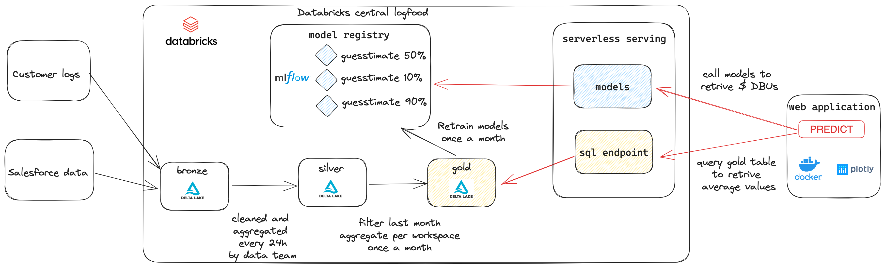

# DBUs Guesstimate

> The idea that the future is unpredictable is undermined
everyday by the ease with which the past is explained. Daniel Kahneman


The aim of this project is to offer an easy to use web interface that helps predicting the monthly consumption of a use case ($/month). 


## Archicture
.

## docker 
1. Install docker on your laptop
2. Create a SQL endpoint
3. Create a .env file
```
# Logfood host
db_host=adb-2548836972759138.18.azuredatabricks.net

# Serverless Starter Endpoint
http_path=/sql/1.0/warehouses/f3b819b95a1c8916

# PAT token
token=your_personal_access_token
```

3. Build and run 

```
docker build --no-cache -t guesstimate . 
docker run --env-file .env -p 4500:8080 guesstimate
```

## To Do
- [ ] Use data from Unity Catalog instead of HMS
- [ ] Register models into UC instead of Models Registry
- [ ] Add docstrings
- [ ] Add tests
- [ ] Improve model performance
- [ ] Add more data (M-1, M-12, M-24, ?) instead of M-1
- [ ] Use Lakehouse Apps when released
- [ ] Improve responsive design
- [ ] Code refactoring
- [ ] Register default values when creating the models instead of retrieving via sql serverless
- [ ] Automation and CI/CD
